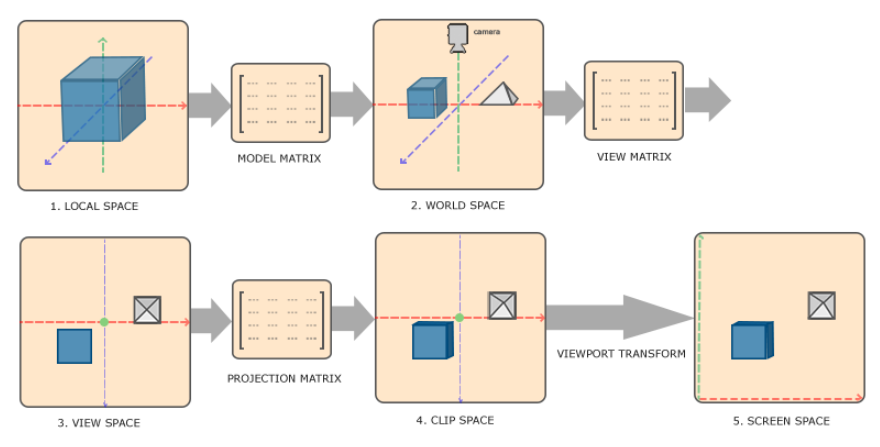

## 카메라 행렬변환

- View Matrix : World Space를 Camera Space로 변환. 카메라의 위치와 방향을 적용.
- Projection Matrix : Camera Space를 Clip Space로 변환. 카메라의 시점 적용.
- 두 개를 편하게 사용하기 위해 VPMatrix를 사용.

>**Clip Position = Projection * View * Model * Local Position**

> 마크다운 행렬은 latex와 동일.
> $I=\begin{bmatrix}1&0&0&0\\0&1&0&0\\0&0&1&0\\0&0&0&1\end{bmatrix}$

### 로드리그 회전 공식
임의의 벡터 $r$에 대해 $\hat{n}$을 축으로 $\theta$만큼 움직인 벡터가 $r′$이라 하면
$\\r′=r_∥+r′ _⟂
\\\quad=(r⋅n̂)n̂+\{r-(r⋅n̂)n̂\}\cos{θ}+\sin{θ}n̂×r
\\\quad=(\cos{\theta})r+(1-\cos{\theta})(r\cdot\hat{n})\hat{n}+(\sin{\theta})\hat{n}\times r
\\$

> $\\\therefore$ 단위벡터 $u=(u_x, u_y, u_z)$에 대해
$\\R=\begin{bmatrix}\c+{u^2}_x(1-c)&u_x u_y (1-c)-u_z s&u_x u_z (1-c)+u_y s&0
\\u_y u_x (1-c)+u_z s&c+{u^2}_y (1-c)&u_y u_z (1-c) - u_x s&0
\\u_z u_x (1-c)-u_y s&u_z u_y (1-c)+u_x s &c+{u^2}_z (1-c)&0
\\0&0&0&1\end{bmatrix} \\(c = \cos{\theta},\quad s=\sin{\theta})$

### 짐벌 락
- Euler Angle 사용 시 회전 축을 90도 돌리게 되면 두 회전축이 겹쳐서 자유도 하나가 사라짐.
- 쿼터니언을 사용해서 예방 가능. (멀티미디어 응용수학)