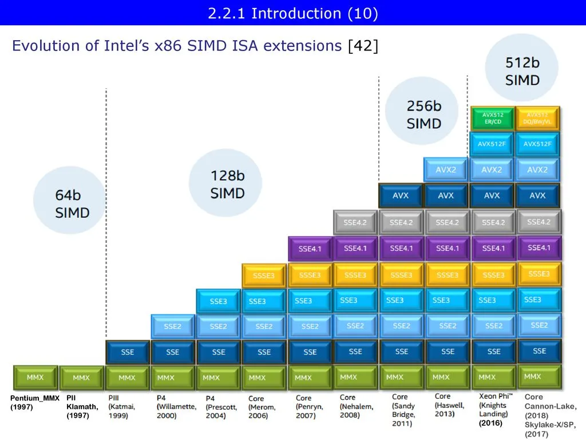

### Window Abstraction
- 플랫폼마다 창을 생성하는 방식이 다르므로 OS별로 창 생성 방식을 하나의 인터페이스로 감쌈.
- 영상에서는 premake5.lua를 사용했지만 본 프로젝트에서는 CMake-Ninja-vcpkg를 사용함.
---
### GLFW Callbacks
- GLFW의 내장 콜백 함수들을 이용
- 콜백 : 이벤트가 발생하면 나중에 호출하도록 등록해두는 함수
    - OnButtonClicked() 같은 함수들
    - UI나 이벤트 시스템에 RegisterClickCallBack(OnButtonClicked) 같은 식으로 등록해 두면
    - 시스템이 나중에 호출함
- GLFW의 콜백 함수
    ```
    void framebuffer_size_callback(GLFWWindow* window, int width, int height)
    {
        glViewPort(0, 0, width, height)
    }
    glfwSetFramebufferSizeCallback(window, framebuffer_size_callback)

    void key_callbakc(GLFWwindow* window, int key, int scancode, int action, int mods)
    {
        if(key == GLFW_KEY_ESCAPE && action == GLFW_PRESS)
        {
            glfwSetWindowShouldClose(window, true)
        }
        //...이런 식으로 키를 하나하나 지정한다고 하고
    }
    glfwSetKeyCallback(window, key, callback);
    ```

### 함수 객체 생성하기
- 문제의 코드 `std::bind(&Application::OnEvent, this, std::placeholders::_1)`
- `Application::OnEvent` 멤버 함수를 나중에 인자 하나를 받아 호출할 수 있는 함수 객체로 묶음.
- 다음의 람다와 같은 함수 객체를 만듦.
```
[this](Event& e)
{
    this->OnEvent(e);
}
```
- `OnEvent`는 멤버 함수이므로 호출하려면 `Application` 객체가 필요함.
- 따라서 `SetEventCallback(&Application::OnEvent);`는 어느 Application의 OnEvent를 호출하는지 모르므로 오류임.
- `this` : 이 객체의 OnEvent를 호출하겠다. (`this->OnEvent(event)`)
- `std::placeholders::_1` : 나중에 들어올 첫 번째 인자
- `this->OnEvent(event)`처럼 실행되며, `_1` 자리에 `event`가 들어감
---
### Window Events
- 창 크기 변경, 조작 등을 Application에 연결함
- Window는 이제 Application에 대해 모름
---
### Input
window는 static이던 아니던 상관없지만 input은 static manager임.
---
### Maths
SIMD 연산을 통해서 행렬, 벡터 연산을 빠르게 수행함.
[블로그에서 보기](https://m.blog.naver.com/fasooai/221650925743)
- SISD(Single Instruction Single Data)
```
void add(int* A, int* B, int* result)
{
    result[0] = A[0] + B[0];
    result[1] = A[1] + B[1];
    result[2] = A[2] + B[2];
    result[3] = A[3] + B[3];
}

int main(int argc, char* argv[])
{
    int a[4] = {1, 2, 3, 4};
    int b[4] = {5, 6, 7, 8};
    int c[4];

    add(a, b, c);
    
    return 0;
}
```
- SIMD : 여러 개의 데이터를 한 명령어로 처리
    - Intel/AMD (뭐가 많음)
    
    - ARM NEON
```
void SimdAdd(int* A, int* B, int* result)
{
    __m128i a = _mm_load_si128((__m128i*)A);
    __m128i b = _mm_load_si128((__m128i*)B);
    __m128i c = _mm_load_si128((__m128i*)C);
}

int main(int argc, char* argv[])
{
    __declspec(allign(16)) int a[4] = {1, 2, 3, 4};
    __declspec(allign(16)) int b[4] = {5, 6, 7, 8};
    __declspec(allign(16)) int c[4];

    add(a, b, c);
    
    return 0;
}
```

- GLM
    - OpenGL '문법'에 기반한 수학 라이브러리.
    - OpenGL에 속하지는 않음
    - SIMD 많이 지원함.
---
### 정적/동적 라이브러리
그냥 GPT 질문 돌림.
> 라이브러리를 정적으로 사용하는 것과 동적으로 사용하는 건 어떤 차이가 있을까?
정적 라이브러리는 빌드할 때 실행 파일 안으로 코드가 복사되고, 동적 라이브러리는 실행 시점에 별도 `.dll`이나 `.so`를 로드합니다.

핵심 차이는 이겁니다.

- `static`: 배포가 단순합니다. 실행 파일 하나로 끝나는 경우가 많고, 실행 환경 의존성이 적습니다. 대신 바이너리가 커지고, 같은 라이브러리를 여러 프로그램이 쓰면 각 실행 파일에 중복 포함됩니다.
- `shared/dynamic`: 실행 파일은 작아지고 여러 프로그램이 같은 라이브러리를 공유할 수 있습니다. 대신 배포 시 DLL 누락, 버전 불일치, 로더 문제를 관리해야 합니다.

실무 관점에서 보면:

- 정적 링크가 유리한 경우: 작은 툴, 배포 단순성이 중요한 게임/엔진 샘플, 외부 설치 의존성을 줄이고 싶을 때
- 동적 링크가 유리한 경우: 플러그인 구조, 모듈 교체, 메모리 공유, 라이브러리 독립 업데이트가 필요할 때

주의할 점도 다릅니다.

- 정적: 라이선스 영향, 빌드 시간 증가, ABI 문제는 덜하지만 업데이트하려면 재빌드가 필요
- 동적: ABI 호환성, export/import 설정, 런타임 검색 경로, 디버그/릴리즈 DLL 혼용 문제를 신경 써야 함

지금 프로젝트 기준으로는 `RiceCore.dll`을 만들고 있으니 엔진 코어는 동적 라이브러리 방식입니다. 반면 vcpkg의 `imgui`는 현재 포트 자체가 정적 라이브러리만 지원합니다. 원하면 이 프로젝트 기준으로 “왜 `RiceCore`는 DLL이고 `imgui`는 static인지”까지 이어서 설명하겠습니다.
>imgui는 왜 static이야?
`imgui`가 보통 `static`으로 쓰이는 이유는 구조 자체가 그쪽이 더 자연스럽기 때문입니다.

첫째, ImGui는 일반적인 “독립 서비스 라이브러리”보다 엔진 내부에 붙는 UI 런타임에 가깝습니다. `ImGuiContext`, backend state, allocator, 전역 설정, draw data 같은 상태를 애플리케이션과 아주 밀접하게 공유합니다. 이걸 DLL 경계 밖으로 빼면 export 설정, 메모리 소유권, CRT 일치, ABI 문제를 더 많이 다뤄야 합니다.

둘째, ImGui 공식 사용 패턴도 보통 소스 포함 또는 정적 링크 쪽입니다. 실제로 `imgui.cpp`, `imgui_draw.cpp`, `imgui_widgets.cpp`, backend `.cpp`들을 프로젝트에 직접 넣는 방식이 흔합니다. 즉 “앱 안에 포함되는 라이브러리”로 설계 감각이 강합니다.

셋째, 배포 이점이 거의 없습니다. ImGui를 DLL로 나눠도 보통 최종 산출물 크기 절감이나 독립 업데이트 이점이 크지 않습니다. 대신 `imgui.dll`과 앱 사이에 컨텍스트/백엔드 초기화 책임만 복잡해집니다.

vcpkg도 그래서 `imgui` 포트를 `ONLY_STATIC_LIBRARY`로 고정해 둡니다. 지금 네 프로젝트에서 본 그 동작이 이 이유입니다.

한 줄로 줄이면: ImGui는 상태 공유가 많고 애플리케이션 내부에 강하게 결합되는 라이브러리라서, DLL로 분리할 실익보다 복잡도가 더 커서 `static`이 기본입니다.

원하면 다음 답변에서 `RiceCore.dll`과 `imgui static`이 섞여 있을 때 어떤 경계 문제가 생길 수 있는지도 바로 설명하겠습니다.
>만약 엔진을 전부 정적으로 만든다면 어떤 장단점이 있을까?
엔진 전체를 정적으로 만들면 가장 큰 장점은 단순성입니다. 실행 파일 하나로 묶이기 쉬워지고, DLL 복사 누락이나 로딩 실패 같은 배포 문제가 줄어듭니다. 지금처럼 학습용 엔진이나 소규모 프로젝트에서는 이 점이 꽤 큽니다.

대신 잃는 것도 분명합니다. 엔진 코드를 조금만 바꿔도 엔진과 이를 사용하는 앱을 함께 다시 링크해야 하고, 모듈을 독립적으로 교체하기 어렵습니다. 플러그인 구조, 에디터/런타임 분리, 핫 리로드 같은 방향으로 가면 정적 링크는 점점 불편해집니다.

정리하면 장점은 이렇습니다.

- 배포가 단순함
- 런타임 DLL 의존성 감소
- import/export 매크로, ABI, DLL 경계 문제 감소
- 디버깅이 상대적으로 단순함
- ImGui 같은 라이브러리와 결합할 때 구조가 자연스러움

단점은 이렇습니다.

- 엔진 수정 시 최종 실행 파일도 다시 빌드해야 함
- 바이너리 크기 증가 가능
- 여러 툴이 같은 엔진을 써도 코드가 각 바이너리에 중복 포함됨
- 모듈 교체, 플러그인, 런타임 확장성이 약함
- 엔진을 별도 제품처럼 배포하거나 버전 관리하기 어려움

지금 네 프로젝트 단계라면 정적 엔진이 더 실용적일 가능성이 큽니다. 반대로 에디터, 게임 런처, 툴 체인, 스크립트 핫 리로드, 외부 모듈화를 하려면 DLL 구조가 점점 의미를 갖습니다.

지금 코드베이스 기준으로 보면 `RiceCore`를 static으로 바꾸는 건 어렵지 않습니다. 다만 `RICE_API`, `RICE_BUILD_DLL` 같은 export/import 매크로 정리까지 같이 해야 제대로 깔끔해집니다.